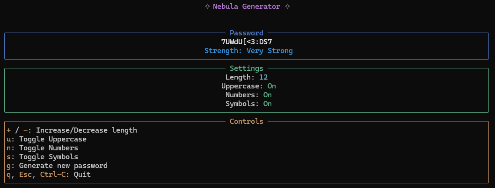

# Nebula Generator

Nebula Generator is a terminal-based password generator built in Rust. It leverages a rich text user interface (TUI) to provide a fast and interactive way to generate secure passwords with customizable settings such as length, use of uppercase letters, numbers, and symbols. The application also evaluates and displays the strength of the generated password.

## Features

- **Customizable Passwords:** Adjust length and toggle uppercase letters, numbers, and symbols.
- **Interactive TUI:** Built using [ratatui](https://github.com/ratatui/ratatui) and [crossterm](https://github.com/crossterm-rs/crossterm) for a clean UI.
- **Password Strength Display:** Evaluates and displays password strength.
- **Keyboard Shortcuts:** Quickly modify settings and generate new passwords.

## Installation

To build and run Nebula Generator, ensure you have [Rust](https://www.rust-lang.org/) installed on your System.

1. Clone the repository:
    ```shell
    git clone https://github.com/RareHyperIonYT/Nebula-Generator.git
    cd nebula-generator
    ```
2. Build the project:
    ```shell
    cargo build --release
    ```

## Usage

Once you run the application, you will be presented with a TUI that displays the current password along with its strength. Use the keyboard controls to modify the password settings and generate a new password.



## License
This project is under the [MIT License](LICENSE).